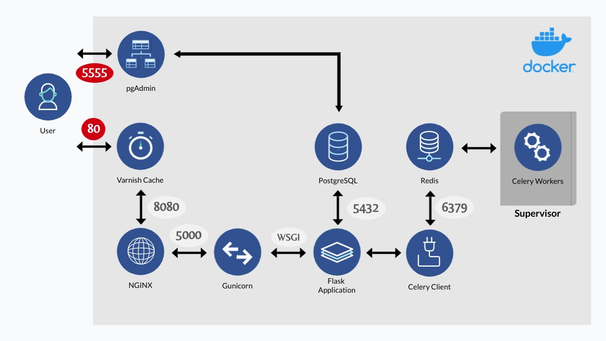

# Varnish-Nginx-Flask-Celery-Postgres

- **Varnish Cache Server** which is a powerful, high-performance HTTP accelerator designed for speeding up the website by up to 1000 percent by caching (or storing) a copy of a webpage the first time a user visits.
- **NGINX** as a reverse-proxy. Even though it has numerous other functionalities, we use it only as an intermediate between Varnish and Gunicorn.
- **Gunicorn** is a pure-Python WSGI HTTP server for our Flask application. you might be wondering why we use NGINX if Gunicorn itself is an HTTP server? Well, it's noted in the documentation that without a proxy to buffer slow clients, the Gunicorn will be easily susceptible to DOS attacks.
- **Celery + Redis:** A typical web application is likely to run some tasks like processing customer transactions, API updates, etc. in the background. a common approach might be using Celery which is a Worker Management for Python that takes care of the hard part of receiving tasks and assigning them appropriately to workers. Redis on the other hand is a message broker to handle the queues between the Flask application and Celery.
- **PostgreSQL** is an advanced, enterprise-class open-source relational database that supports both SQL (relational) and JSON (non-relational) querying. It is a highly stable database management system, backed by more than 20 years of community development which has contributed to its high levels of resilience, integrity, and correctness. PostgreSQL is used as the primary data store or data warehouse for many web, mobile, geospatial, and analytics applications.
- **pgAdmin** is the most popular and feature-rich Open Source administration and development platform for PostgreSQL. You'd better disable or restrict access to pgAdmin on your production environment. it's also recommended to choose a strong password to log in.

## Default values

Default values are stored in the `.env` file. remember to **CHANGE** the username and password!

**Username:** admin

**Password:** admin123